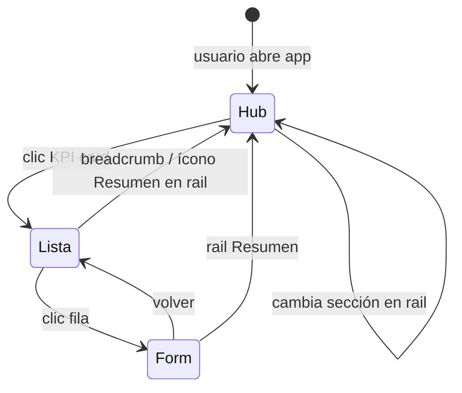

# Plan — Rail de secciones + KPI cards de ingreso

**Estado:** planificado · **Fecha:** 2026-07-03  
**Relacionado:** [plan-liquid-glass-kpi-routes.md](./plan-liquid-glass-kpi-routes.md) · [plan-rail-expandible-odoo.md](./plan-rail-expandible-odoo.md) · [liquid-glass-odoo.md](../design/liquid-glass-odoo.md)

---

## 1. Concepto unificado

Patrón **App Hub Shell** para el backend Odoo de Servigas:

| Elemento | Rol | Metáfora |
|----------|-----|----------|
| **Rail izquierdo** | Navegar entre **secciones** de la app activa | Índice / tabla de contenidos |
| **Área central** | **KPI cards** que son puntos de **ingreso** a subvistas | Puertas con dato útil antes de entrar |
| **Navbar Odoo** | Cambio de app global (Inventario → Ventas → …) | Sin reemplazar en v1 |

```
┌──────────┬─────────────────────────────────────────────┐
│  RAIL    │  ÁREA CENTRAL — KPI cards de ingreso        │
│          │                                             │
│ ▶ Resumen│   ┌──────────┐  ┌──────────┐  ┌──────────┐ │
│   Productos   │  8.767   │  │    23    │  │  $4.2M   │ │
│   Operac.│   │ Productos│  │Bajo stock│  │  Valor   │ │
│   Informes   │  [ingresar]│  [ingresar]│  [ingresar]│ │
│   Config │   └──────────┘  └──────────┘  └──────────┘ │
│          │   ┌──────────┐  ┌──────────┐               │
│  [ ◀ ]   │   │   142    │  │    12    │               │
│          │   │Categorías│  │Sin precio│               │
└──────────┴── └──────────┘  └──────────┘               │
```

**Clic en sección del rail** → filtra qué KPI cards se muestran en el centro.  
**Clic en KPI card** → abre la acción Odoo (`ir.actions.act_window`) con dominio/filtro preaplicado.

Las KPI cards **no son botones de acción** (guardar, crear): son **tarjetas de acceso** con métrica en tiempo real.

---

## 2. Evaluación de la idea

### 2.1 Ventajas

| Ventaja | Detalle |
|---------|---------|
| UX moderna y clara | Una sola pantalla de «home» por app; el usuario ve números antes de entrar |
| Alineado a Liquid Glass v2 | Rail glass colapsable + grid KPI en canvas continuo |
| Reduce dependencia del menú Odoo | Subvistas accesibles sin dropdowns en navbar |
| Escala por app | Mismo patrón replicable en Inventario, Ventas, Compras |
| Datos útiles | Cada card responde «¿qué hay adentro?» con un número |

### 2.2 Límites y reglas

| Regla | Motivo |
|-------|--------|
| Solo en **hubs** (`ir.actions.client`) | No envolver listas/form estándar — evita doble scroll y parches frágiles |
| Al ingresar a lista/form, **sale del hub** | Vista operativa Odoo nativa + botones flame |
| **Sin hub en POS** | Mostrador mantiene UI POS actual |
| **Sin hub en Ajustes** | Settings ya tiene secciones propias |
| Máx. **6–8 cards** visibles por sección | Legibilidad; el resto en «Ver más» |
| Card siempre con **valor + etiqueta + affordance** | Valor numérico, nombre sección, hover/ícono «ingresar» |

### 2.3 Veredicto

**Sí — como pantalla de entrada por app**, no como reemplazo de toda la navegación Odoo.

Pantalla por defecto al abrir Inventario / Ventas / Compras (menú «Resumen» o `sequence=1`).

---

## 3. Arquitectura UX

### 3.1 Estados del shell



### 3.2 Rail — secciones

| Propiedad | Valor |
|-----------|-------|
| Posición | Izquierda, fijo |
| Colapsado | 56 px — solo iconos + tooltip |
| Expandido | 240 px — icono + etiqueta |
| Toggle | Botón al pie del rail; persistencia `localStorage` |
| Sección activa | Pill / borde llama (`--sg-flame-deep`) |
| Scroll | Solo si >8 secciones (poco probable) |

### 3.3 KPI card de ingreso — anatomía

```
┌─────────────────────────────┐
│  [icono]                    │
│  8.767          ← valor KPI │
│  Productos      ← etiqueta  │
│  Ver catálogo → ← affordance│
└─────────────────────────────┘
  .sg-glass-kpi.sg-entry-card
```

| Parte | Contenido |
|-------|-----------|
| `value` | Número o texto corto (`read_group` / `search_count`) |
| `label` | Nombre de la subvista |
| `hint` | Opcional — «últimos 7 días», «sin IVA» |
| `icon` | Icono Odoo de la acción o emoji marca |
| `variant` | `default` · `warning` (alertas) · `accent` (destacado) |
| `action` | `ir.actions.act_window` + `domain` + `context` |
| `badge` | Opcional — contador urgente |

**Interacción:** clic en toda la card = `doAction(action)`. Hover: elevación + borde llama.

### 3.4 Diferencia con otros patrones

| Patrón | Rail secciones | KPI ingreso | Dónde |
|--------|----------------|-------------|-------|
| Este plan | ● Izq | ● Centro hub | Pantalla Resumen por app |
| Plan KPI — stat buttons | — | Mini KPI | Formularios |
| Plan KPI — strip lista | — | Strip horizontal | Listas (alternativa; no combinar con hub) |
| Plan rail — rail derecho | — | Tab contextual | Listas (descartado si hay hub) |

---

## 4. Inventario por app

### 4.1 Inventario (`stock`) — piloto

#### Secciones del rail

| ID | Sección | Icono | Descripción |
|----|---------|-------|-------------|
| `summary` | Resumen | `fa-th-large` | Vista global — todas las cards destacadas |
| `products` | Productos | `fa-cube` | Catálogo y clasificación |
| `operations` | Operaciones | `fa-exchange` | Movimientos físicos |
| `reporting` | Informes | `fa-bar-chart` | Análisis y valoración |
| `config` | Configuración | `fa-cog` | Ajustes de inventario |

#### KPI cards de ingreso por sección

**Resumen** (cards destacadas cross-sección):

| Card | Valor (fuente) | Acción destino |
|------|----------------|----------------|
| Productos activos | `product.product` count active | `stock.product_template_action` |
| Bajo stock | count qty < min | Lista productos + dominio |
| Valor inventario | sum valuation | Informe valoración |
| Transferencias hoy | `stock.picking` count hoy | Transferencias filtradas |
| Ajustes pendientes | `stock.quant` inventory | Ajustes inventario |

**Productos:**

| Card | Valor | Destino |
|------|-------|---------|
| Catálogo completo | count templates | Lista productos |
| Variantes | count variants | Lista variantes |
| Categorías | count categories | Árbol categorías |
| Sin precio de venta | count list_price = 0 | Lista filtrada |
| Sin código de barras | count barcode false | Lista filtrada |

**Operaciones:**

| Card | Valor | Destino |
|------|-------|---------|
| Transferencias internas | count state assigned | Transferencias |
| Por validar | count state waiting | Pickings pendientes |
| Ajustes de inventario | count quants en inv | Ajustes |
| Recepciones | count incoming | Recepciones |
| Entregas | count outgoing | Entregas |

**Informes:**

| Card | Valor | Destino |
|------|-------|---------|
| Valoración de stock | valor total | Pivot valoración |
| Movimientos (30 días) | count moves | Informe movimientos |
| Reglas de reabastecimiento | count rules | Reglas |

**Configuración:**

| Card | Valor | Destino |
|------|-------|---------|
| Ubicaciones | count locations | Ubicaciones |
| Tipos de operación | count picking types | Tipos |
| Almacenes | count warehouses | Almacenes |

---

### 4.2 Ventas (`sale_management`)

#### Secciones rail

`summary` · `orders` · `customers` · `reporting` · `config`

#### KPI cards principales

| Sección | Cards |
|---------|-------|
| Resumen | Ventas hoy ($), Pedidos borrador, A confirmar, Clientes activos |
| Pedidos | Cotizaciones, Pedidos confirmados, A entregar, POS backend |
| Clientes | Total clientes, Nuevos este mes |
| Informes | Ventas por producto, Ventas por cliente |
| Config | Equipos venta, Términos pago |

---

### 4.3 Compras (`purchase`)

#### Secciones rail

`summary` · `orders` · `vendors` · `reporting` · `config`

#### KPI cards principales

| Sección | Cards |
|---------|-------|
| Resumen | OC pendientes, A recepcionar, Proveedores activos |
| Órdenes | Borradores, Enviadas, Recibidas parcial |
| Proveedores | Total, Con OC este mes |
| Informes | Compras por proveedor, Análisis |
| Config | Condiciones proveedor |

---

### 4.4 Facturación (`account`)

#### Secciones rail

`summary` · `invoices` · `payments` · `reporting`

#### KPI cards principales

| Sección | Cards |
|---------|-------|
| Resumen | Facturas pendientes cobro, Pendientes pago, Total mes |
| Facturas | Clientes borrador, Clientes publicadas, Proveedores |
| Pagos | Pagos registrados hoy, Por conciliar |
| Informes | Balance, PyG (si visible en CE) |

**Nota:** AFIP/ARCA fuera de alcance — card «Facturación electrónica» como `variant: warning` deshabilitada o informativa.

---

### 4.5 Apps sin hub (mantener Odoo estándar)

| App | Motivo |
|-----|--------|
| POS | UI mostrador separada |
| Ajustes generales | Secciones settings nativas |
| Empleados / CRM | Fuera de alcance Servigas |

---

## 5. Flujo de navegación

```
Usuario abre app Inventario
        ↓
Hub Resumen (rail: Resumen activo)
  → ve 5–6 KPI cards globales
        ↓
Clic rail «Operaciones»
  → centro muestra cards de transferencias, ajustes, etc.
        ↓
Clic card «Transferencias internas» (valor: 12)
  → doAction → lista Odoo filtrada
  → rail permanece visible (colapsado) como ancla
        ↓
Clic rail «Resumen» o logo Servigas
  → vuelve al hub
```

### Breadcrumb en vistas operativas

Cuando el usuario está en lista/form tras ingresar por card:

```
Inventario  ›  Operaciones  ›  Transferencias internas
   ↑ hub          ↑ sección         ↑ vista actual
```

Implementar con extensión del control panel o barra superior mínima — **no** duplicar rail completo en listas en v1.

---

## 6. Diseño visual

### 6.1 Layout shell

```scss
.sg-app-shell {
  display: flex;
  height: 100%;
  min-height: 0;
  background: var(--sg-paper);

  &__rail { flex-shrink: 0; }
  &__main {
    flex: 1;
    min-width: 0;
    overflow-y: auto; // único scroll del hub
  }
}
```

### 6.2 Grid de KPI cards

```scss
.sg-entry-grid {
  display: grid;
  grid-template-columns: repeat(auto-fill, minmax(220px, 1fr));
  gap: 1rem;
  padding: 1.5rem;
  max-width: 80rem;
  margin-inline: auto;
}

.sg-entry-card {
  @include sg-glass-surface($elevated: true, $on-dark: false);
  cursor: pointer;
  padding: 1.25rem;
  transition: transform var(--sg-rail-transition), box-shadow var(--sg-rail-transition);

  &:hover {
    transform: translateY(-2px);
    box-shadow: 0 8px 24px rgba($sg-flame-deep, 0.12);
    border-color: rgba($sg-flame-deep, 0.35);
  }

  &__value {
    font-size: 2rem;
    font-weight: 700;
    color: var(--sg-flame-deep);
    line-height: 1.1;
  }

  &__label {
    font-size: 0.95rem;
    font-weight: 600;
    margin-top: 0.25rem;
  }

  &__hint {
    font-size: 0.8rem;
    opacity: 0.65;
    margin-top: 0.15rem;
  }

  &__enter {
    font-size: 0.8rem;
    color: var(--sg-flame-deep);
    margin-top: 0.75rem;
    font-weight: 500;
  }
}
```

### 6.3 Rail secciones

```scss
.sg-section-rail {
  @include sg-glass-surface($on-dark: true);
  background: linear-gradient(180deg, $sg-bg-charcoal, $sg-bg-deep);
  width: var(--sg-rail-width-collapsed);
  transition: width var(--sg-rail-transition);

  &--expanded { width: var(--sg-rail-width-expanded); }

  &__item {
    display: flex;
    align-items: center;
    gap: 0.75rem;
    padding: 0.75rem 1rem;
    color: var(--sg-text-muted-dark);
    cursor: pointer;
    border-left: 3px solid transparent;

    &--active {
      color: var(--sg-text-on-dark);
      border-left-color: var(--sg-flame-deep);
      background: rgba($sg-flame-deep, 0.15);
    }
  }
}
```

### 6.4 Motion

- Entrada hub: `.sg-view-enter` en grid
- Cards: `.sg-stagger-item` con delay incremental (máx. 6 items)
- `prefers-reduced-motion: reduce` → sin stagger

---

## 7. Arquitectura técnica

### 7.1 Estructura de archivos

```
servigas_core/
├── models/
│   ├── sg_hub_section.py       # secciones por app (opcional v2)
│   └── sg_entry_card.py        # definición cards (datos + acción)
├── data/
│   └── hub_inventory.xml       # cards Inventario
├── views/
│   └── hub_menus.xml           # menús Resumen + ir.actions.client
└── static/src/js/
    ├── components/
    │   ├── sg_section_rail.js
    │   ├── sg_section_rail.xml
    │   ├── sg_entry_card.js
    │   ├── sg_entry_card.xml
    │   └── sg_entry_grid.js
    ├── shells/
    │   ├── sg_app_shell.js     # layout rail + main
    │   └── sg_app_shell.xml
    └── hubs/
        ├── inventory_hub.js    # registra client action
        └── inventory_hub.xml
```

### 7.2 Registro client action

```javascript
// inventory_hub.js
import { registry } from "@web/core/registry";
import { SgAppShell } from "../shells/sg_app_shell";

export class InventoryHub extends SgAppShell {
    static template = "servigas_core.InventoryHub";
    static props = { ...SgAppShell.props };

    get appId() { return "inventory"; }
    get sections() { return this.env.services.sg_hub.getSections("inventory"); }
    get activeSection() { return this.state.section; }
    get entryCards() {
        return this.env.services.sg_hub.getCards("inventory", this.state.section);
    }
}

registry.category("actions").add("servigas_inventory_hub", InventoryHub);
```

### 7.3 Servicio `sg_hub`

```javascript
// Responsabilidades:
// - Cargar secciones y cards (RPC o JSON estático en v1)
// - Resolver valores KPI (search_count / read_group en paralelo)
// - doAction al clic card
// - Caché 60s por card para no saturar RPC
```

### 7.4 Definición de cards en Python (v1 recomendado)

```python
# models/sg_hub_config.py
class SgHubCard(models.Model):
    _name = "sg.hub.card"
    _order = "section, sequence"

    app = fields.Selection([
        ("inventory", "Inventario"),
        ("sales", "Ventas"),
        ("purchase", "Compras"),
        ("accounting", "Facturación"),
    ], required=True)
    section = fields.Char(required=True)  # products, operations, ...
    sequence = fields.Integer(default=10)
    label = fields.Char(required=True)
    hint = fields.Char()
    icon = fields.Char()
    variant = fields.Selection([("default", "Default"), ("warning", "Warning")])
    action_id = fields.Many2one("ir.actions.act_window", required=True)
    domain = fields.Char(default="[]")
    context = fields.Char(default="{}")
    metric_model = fields.Char()          # product.product
    metric_domain = fields.Char()         # [('active','=',True)]
    metric_field = fields.Char()          # vacío = count; o sum field
    metric_aggregate = fields.Selection([("count", "Count"), ("sum", "Sum")])
```

Ventaja: cards configurables sin redeploy JS; datos XML por app.

### 7.5 XML menú — Inventario

```xml
<record id="action_inventory_hub" model="ir.actions.client">
    <field name="name">Resumen</field>
    <field name="tag">servigas_inventory_hub</field>
</record>

<menuitem id="menu_inventory_hub"
          name="Resumen"
          parent="stock.menu_stock_root"
          action="action_inventory_hub"
          sequence="1"/>
```

---

## 8. Fases de implementación

| Fase | Entregable | Dependencias |
|------|------------|--------------|
| **H0** | SCSS: `.sg-app-shell`, `.sg-section-rail`, `.sg-entry-card`, `.sg-entry-grid` | `servigas_tokens.scss` |
| **H1** | `SgEntryCard` + `SgSectionRail` + `SgAppShell` (datos mock) | H0 |
| **H2** | Modelo `sg.hub.card` + datos XML Inventario + RPC métricas | H1 |
| **H3** | `servigas_inventory_hub` client action + menú Resumen | H2 |
| **H4** | Hub Ventas (replicar patrón) | H3 validado |
| **H5** | Hub Compras + Facturación | H4 |
| **H6** | Breadcrumb «volver al Resumen» en listas ingresadas | H3 |
| **H7** | Rail colapsable + persistencia + responsive tablet | H3 |

### Criterio de éxito piloto (Inventario)

- [ ] Menú «Resumen» abre hub con rail 5 secciones
- [ ] Clic sección cambia cards en < 200 ms (sin RPC si cards estáticas)
- [ ] Valores KPI cargan en < 2 s (8.767 SKU)
- [ ] Clic card abre lista Odoo con filtro correcto
- [ ] Rail colapsa/expande; preferencia persiste
- [ ] Sin glass en listas destino; botón Crear sigue flame

---

## 9. Matriz esfuerzo / valor

| Fase | Esfuerzo | Valor negocio | Riesgo |
|------|----------|---------------|--------|
| H0 SCSS | Bajo | Medio | Mínimo |
| H1 Componentes | Medio | Medio | Bajo |
| H2 Modelo + datos | Medio | Alto | Bajo |
| H3 Hub Inventario | Medio | **Muy alto** | Medio |
| H4–H5 Réplicas | Medio c/u | Alto | Bajo |
| H6 Breadcrumb | Bajo | Medio | Medio |
| H7 Responsive | Bajo | Medio | Bajo |

---

## 10. Riesgos

| Riesgo | Mitigación |
|--------|------------|
| RPC lento con 8.767 SKU | `search_count` indexado; caché 60s; loading skeleton en card |
| Duplicar menús Odoo | Hub es **atajo**, no elimina menús existentes |
| Usuario pierde hub | Menú «Resumen» siempre `sequence=1`; breadcrumb vuelta |
| Cards desactualizadas | TTL caché + botón refrescar discreto en hub |
| Mantener XML cards | Modelo `sg.hub.card` editable por admin técnico |

---

## 11. Relación con planes anteriores

| Plan anterior | Este plan |
|---------------|-----------|
| KPI hub full-page sin rail | **Evoluciona** — rail añade secciones |
| Rail derecho contextual en listas | **Descartado en v1** — hub centraliza ingreso |
| KPI strip en listas | **Opcional** — solo si no se usa hub como entrada |
| Stat buttons en forms | **Sin cambio** |

**Orden de ejecución unificado:**

```
H0 SCSS (shell + entry cards + section rail)
    ↓
H1 Componentes OWL
    ↓
H2 Modelo sg.hub.card + XML Inventario
    ↓
H3 Hub Inventario piloto  ← entregable MVP
    ↓
H4 Hub Ventas → H5 Compras/Facturación
```

---

## 12. Decisión final

| Pregunta | Respuesta |
|----------|-----------|
| ¿Rail para qué? | **Navegar secciones** dentro de cada app |
| ¿KPI cards para qué? | **Ingresar** a subvistas con dato previo |
| ¿Dónde vive? | Pantalla **Resumen** (`ir.actions.client`) por app |
| ¿Reemplaza listas/forms? | **No** — solo puerta de entrada |
| ¿Primera app? | **Inventario** (8.767 SKU, operación diaria) |

---

*Documento generado: 2026-07-03*
