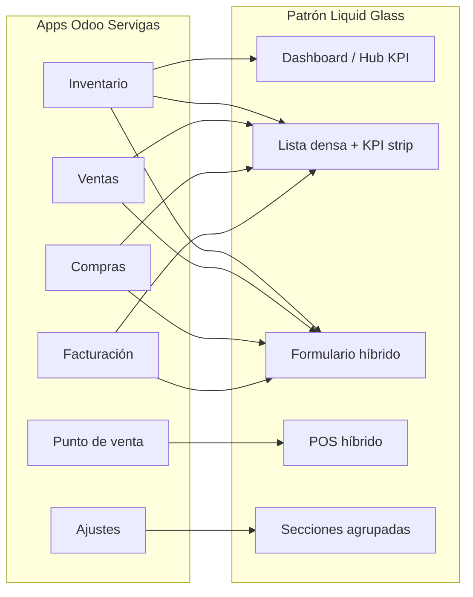

# Plan — Liquid Glass v2 con KPI cards estratégicas

**Estado:** planificado · **Fecha:** 2026-07-03  
**Relacionado:** [liquid-glass-odoo.md](../design/liquid-glass-odoo.md) · [ADR 0001](../adr/0001-liquid-glass-odoo-frontend.md) · [bitacora-cambios.md](./bitacora-cambios.md)

---

## 1. Objetivo

Modernizar la UI de Odoo 19 en Servigas con **Liquid Glass v2**, usando **KPI cards de forma estratégica** (no como sustituto de todos los botones), alineado al ADR 0001 y al alcance operativo del negocio.

### Principio rector

| Superficie | Patrón | Ejemplo |
|------------|--------|---------|
| Métrica / resumen / atajo de navegación | **KPI card glass** | «8.767 productos», «23 bajo stock» |
| Acción primaria | **Flame CTA** | Crear, Guardar, Cobrar |
| Acción secundaria | **Outline / ghost** | Cancelar, Exportar |
| Navegación contextual | **Subnav pills** | Tabs, categorías POS |
| Búsqueda / filtros | **Command bar** | Búsqueda código fabricante |
| Datos tabulares | **Lista densa** | Sin glass por fila |

---

## 2. Inventario de rutas (apps Odoo Servigas)

Módulos operativos según `CONTEXT.md`: `stock`, `sale_management`, `point_of_sale`, `purchase`, `account`.  
No hay rutas HTTP ni menús custom activos en `servigas_core` (todo es Odoo estándar).

### 2.1 Mapa de apps



---

## 3. Evaluación por ruta

Leyenda de columnas:

- **Patrón:** patrón Liquid Glass asignado
- **KPI:** uso de KPI cards (● alto · ◐ parcial · ○ no)
- **Capa:** S = SCSS · O = OWL · X = XML inherit
- **P:** prioridad (1 = más alta)
- **Estado:** hoy en `servigas_core`

### 3.1 Inventario (`stock`)

| Ruta (menú Odoo) | Vista | Patrón | KPI | Botones clave | Tratamiento botones | Capa | P | Estado |
|------------------|-------|--------|-----|---------------|---------------------|------|---|--------|
| **Hub Inventario** *(nuevo)* | Client action | Dashboard v2 | ● | Cards navegables | Card = atajo; sin botones duplicados | O+X | 1 | No existe |
| Productos → Productos | Lista | Lista + strip | ◐ | Nuevo, Importar, Acciones | Flame CTA en Nuevo; strip KPI arriba | S+O | 2 | Solo flame en `.btn-primary` |
| Productos → Variantes | Lista | Lista densa | ○ | Nuevo, Filtros | Flame CTA | S | 4 | Parcial |
| Productos → Categorías | Lista / form | Lista densa | ○ | Nuevo, Guardar | Flame CTA | S | 5 | Parcial |
| Producto (form) | Formulario | Híbrido | ◐ | Stat buttons, Guardar, Acciones | Stat buttons → mini KPI cards; Guardar = flame | S | 2 | Stat buttons solo tipografía |
| Operaciones → Transferencias | Lista | Lista densa | ◐ | Nuevo, Validar (form) | KPI strip: pendientes / hoy; Validar = flame | S+O | 3 | Parcial |
| Operaciones → Ajustes inventario | Lista / form | Lista + híbrido | ◐ | Aplicar, Validar | KPI: ajustes pendientes | S+O | 3 | Parcial |
| Operaciones → Recepciones / Entregas | Lista | Lista densa | ◐ | Validar, Imprimir | Strip opcional por estado | S | 4 | Parcial |
| Informes → Valoración stock | Pivot / graph | Dashboard v2 | ● | Filtros, Agrupar | KPI cards resumen + paneles glass | O+S | 3 | No iniciado |
| Informes → Movimientos | Lista / pivot | Lista + KPI header | ◐ | Exportar | KPI arriba; lista densa abajo | S+O | 4 | No iniciado |
| Configuración | Settings | Secciones | ○ | Guardar | Botones discretos flame | S | 6 | Parcial |

**KPIs sugeridos — Hub Inventario:**

| Card | Métrica | Acción al clic |
|------|---------|----------------|
| Catálogo | Total productos activos | Lista productos |
| Bajo stock | Productos bajo mínimo | Lista filtrada |
| Valor inventario | Valoración a costo | Informe valoración |
| Movimientos hoy | Transferencias del día | Movimientos filtrados |

---

### 3.2 Punto de venta (`point_of_sale`)

| Ruta | Vista | Patrón | KPI | Botones clave | Tratamiento | Capa | P | Estado |
|------|-------|--------|-----|---------------|-------------|------|---|--------|
| **Sesión POS** (mostrador) | POS OWL | POS híbrido | ○ | Categorías, Cobrar, Numpad | Command bar búsqueda; pills categoría; Cobrar = flame CTA | S | 1 | **Avanzado** |
| Pedidos POS (backend) | Lista | Lista + strip | ◐ | Nuevo, Exportar | Strip: ventas hoy / ticket promedio | S+O | 3 | Parcial |
| Sesiones | Lista | Lista densa | ◐ | Abrir / Cerrar | KPI: sesión abierta | S | 4 | Parcial |
| Configuración POS | Form settings | Secciones | ○ | Guardar | Flame CTA | S | 5 | Parcial |

**Nota POS:** no usar KPI cards en grid de productos ni en línea de pedido (regla marca §3). El equivalente visual es **command bar** + **pills** + **product tiles glass ligeros** (ya implementados).

**Pendientes POS identificados:**

- [ ] Clase explícita `.sg-command-bar` en wrapper búsqueda (hoy es selector DOM)
- [ ] Montserrat cargada en bundle POS
- [ ] Búsqueda por código fabricante prominente (negocio)
- [ ] Verificar `servigas_logo.png` en assets

---

### 3.3 Ventas (`sale_management`)

| Ruta | Vista | Patrón | KPI | Botones clave | Tratamiento | Capa | P | Estado |
|------|-------|--------|-----|---------------|-------------|------|---|--------|
| **Hub Ventas** *(nuevo)* | Client action | Dashboard v2 | ● | Cards | Ventas hoy, pendientes, top clientes | O+X | 2 | No existe |
| Pedidos / Cotizaciones | Lista | Lista + strip | ◐ | Nuevo, Confirmar | Strip KPI; Confirmar = flame en form | S+O | 3 | Parcial |
| Pedido (form) | Formulario | Híbrido | ◐ | Stat buttons, Confirmar, Entregar | Mini KPI en stats (margen, entregado) | S | 3 | Parcial |
| Clientes | Lista / form | Lista densa | ○ | Nuevo, Guardar | Flame CTA | S | 5 | Parcial |
| Informes ventas | Pivot / graph | Dashboard v2 | ● | Filtros | KPI cards período | O+S | 4 | No iniciado |
| Configuración | Settings | Secciones | ○ | Guardar | Discreto | S | 6 | Parcial |

---

### 3.4 Compras (`purchase`)

| Ruta | Vista | Patrón | KPI | Botones clave | Tratamiento | Capa | P | Estado |
|------|-------|--------|-----|---------------|-------------|------|---|--------|
| **Hub Compras** *(nuevo)* | Client action | Dashboard v2 | ● | Cards | OC pendientes, recepciones, proveedores | O+X | 3 | No existe |
| Solicitudes / OC | Lista | Lista + strip | ◐ | Nuevo, Confirmar, Recibir | Strip KPI; acciones = flame | S+O | 3 | Parcial |
| OC (form) | Formulario | Híbrido | ◐ | Stat buttons, Confirmar | Mini KPI (recibido / facturado) | S | 4 | Parcial |
| Proveedores | Lista / form | Lista densa | ○ | Nuevo | Flame CTA | S | 5 | Parcial |
| Informes compras | Pivot | Dashboard v2 | ● | Filtros | KPI cards | O+S | 5 | No iniciado |

---

### 3.5 Facturación / Contabilidad (`account`)

| Ruta | Vista | Patrón | KPI | Botones clave | Tratamiento | Capa | P | Estado |
|------|-------|--------|-----|---------------|-------------|------|---|--------|
| Tablero contable *(si visible)* | Dashboard | Dashboard v2 | ● | Cards | Ingresos, egresos, pendientes AFIP | O+S | 4 | No iniciado |
| Facturas clientes / proveedores | Lista | Lista + strip | ◐ | Nuevo, Confirmar, Registrar pago | Strip; statusbar en form | S+O | 4 | Parcial |
| Factura (form) | Formulario | Híbrido | ◐ | Stat buttons, Confirmar, Enviar | Mini KPI (pagos, entregas) | S | 4 | Parcial |
| Pagos | Lista / form | Lista densa | ○ | Registrar | Flame CTA | S | 5 | Parcial |
| Plan contable | Lista jerárquica | Lista densa | ○ | Nuevo | Sin glass | S | 6 | Parcial |
| Informes contables | Reportes | Dashboard / lista | ◐ | Exportar PDF | KPI resumen período | S+O | 5 | No iniciado |

**Nota:** facturación electrónica AFIP fuera de alcance; UI debe preparar «pendiente» sin bloquear operación manual Factura Web.

---

### 3.6 Ajustes (`base` / settings)

| Ruta | Vista | Patrón | KPI | Botones clave | Tratamiento | Capa | P | Estado |
|------|-------|--------|-----|---------------|-------------|------|---|--------|
| Ajustes generales | Settings scroll | Secciones | ○ | Guardar por sección | Sin KPI; agrupación clara | S | 6 | Parcial |
| Usuarios / Compañía | Form | Secciones | ○ | Guardar | Flame CTA | S | 6 | Parcial |

---

### 3.7 Web pública (`web/` — Astro)

| Ruta | Vista | Patrón | KPI | Estado |
|------|-------|--------|-----|--------|
| `/` | Landing | Glass panel | ○ (futuro) | Scaffold; sin integración Odoo |

Fuera del alcance de este plan salvo alinear tokens `--sg-*` con Odoo.

---

## 4. Taxonomía de botones Odoo — evaluación global

Inventario de **tipos de botón** presentes en todas las rutas y decisión de tratamiento.

| Tipo de botón | Selector / ubicación | ¿KPI card? | Tratamiento Servigas | Capa | Apps |
|---------------|----------------------|------------|----------------------|------|------|
| **App switcher** | `.o_menu_apps` | No | Mantener Odoo; iconos estándar | — | Global |
| **Navbar secciones** | `.o_menu_sections .o_nav_entry` | No | Gradiente carbón + hover llama (**hecho**) | S | Global |
| **Menú lateral** | `.o_menu_item` | No | Tipografía Montserrat; sin glass | S | Global |
| **Crear (lista)** | `.o_list_button_add`, `.o-kanban-button-new` | No | Flame CTA (**hecho**) | S | Todas listas |
| **Guardar / Descartar** | `.o_form_button_save`, statusbar | No | Guardar = flame; Descartar = outline | S | Formularios |
| **Statusbar workflow** | `.o_statusbar_status .btn` | No | Flame en estado activo (**hecho**) | S | Pedidos, OC, pickings |
| **Smart / stat buttons** | `.oe_stat_button` | **Sí (mini KPI)** | Glass card + valor flame | S | Formularios |
| **Acciones (engranaje)** | `.o_dropdown` Action | No | Estilo outline; menú estándar | S | Listas / forms |
| **Filtros / Agrupar** | `.o_searchview` | No | Command bar styling en input | S | Listas |
| **Tabs / pills** | `.nav-tabs`, `.nav-pills` | No | Pill activa = gradiente (**hecho**) | S | Forms multi-tab |
| **Kanban stage** | `.o_kanban_stage` | No | Pills; sin glass por card | S | CRM-like views |
| **Informe Imprimir** | `.o_report_buttons` | No | Outline | S | Reportes |
| **POS Categorías** | `.category-button` | No | Pills glass (**hecho**) | S | POS |
| **POS Cobrar** | `.pay-order-button` | No | Flame CTA grande (**hecho**) | S | POS |
| **POS Numpad** | `.numpad .btn` | No | Tipografía; sin KPI | S | POS |
| **POS Producto tile** | `.product` | No | Glass tile ligero (**hecho**) | S | POS |
| **Hub navegación** | `.sg-glass-kpi` *(nuevo)* | **Sí** | KPI card completa | O+S | Hubs por app |
| **KPI strip lista** | `.sg-kpi-strip` *(nuevo)* | **Sí** | Fila compacta 3–4 métricas | O+S | Listas operativas |

### Resumen numérico

| Categoría | Cantidad aprox. de contextos | Con KPI card |
|-----------|------------------------------|--------------|
| Botones de acción (CTA) | ~15 selectores globales | 0 |
| Botones de navegación menú | 3 niveles navbar | 0 |
| Smart buttons (form) | ~5–8 por formulario clave | **Sí (mini)** |
| Hub cards (nuevos) | 4 apps × 4 cards | **Sí (completo)** |
| KPI strip (listas) | ~10 listas operativas | **Sí (compacto)** |
| Informes dashboard | ~6 informes | **Sí (completo)** |

---

## 5. Arquitectura técnica

### 5.1 Estructura de archivos objetivo

```
servigas_core/
├── static/src/
│   ├── scss/
│   │   ├── servigas_tokens.scss         # existente
│   │   ├── servigas_primary_variables.scss
│   │   ├── servigas_backend.scss
│   │   ├── servigas_pos.scss
│   │   └── servigas_dashboard.scss      # NUEVO — KPI, strip, layout, motion
│   ├── js/
│   │   ├── components/
│   │   │   ├── kpi_card.js
│   │   │   ├── kpi_card.xml
│   │   │   ├── kpi_strip.js
│   │   │   └── kpi_strip.xml
│   │   └── dashboards/
│   │       ├── inventory_dashboard.js
│   │       ├── inventory_dashboard.xml
│   │       ├── sales_dashboard.js
│   │       └── purchase_dashboard.js
│   └── img/
│       └── servigas_logo.png
├── views/
│   ├── dashboards.xml                   # NUEVO — ir.actions.client + menus
│   └── views.xml
└── __manifest__.py                        # +depends sale_management, purchase, account
```

### 5.2 Clases CSS a implementar

| Clase | Propósito | Archivo |
|-------|-----------|---------|
| `.sg-glass-kpi` | Card KPI navegable | `servigas_dashboard.scss` |
| `.sg-glass-panel` | Panel agrupación | `servigas_dashboard.scss` |
| `.sg-kpi-grid` | Grid responsive cards | `servigas_dashboard.scss` |
| `.sg-kpi-strip` | Fila compacta en listas | `servigas_dashboard.scss` |
| `.sg-command-bar` | Wrapper búsqueda | `servigas_dashboard.scss` + POS |
| `.sg-subnav` | Tabs sticky | `servigas_dashboard.scss` |
| `.sg-module-root` / `.sg-page` / `.sg-scroll` | Flex scroll chain | `servigas_dashboard.scss` |
| `.sg-view-enter` / `.sg-stagger-*` | Motion | `servigas_dashboard.scss` |
| `.sg-stat-kpi` | Stat button elevado | `servigas_backend.scss` |

### 5.3 Componente OWL `SgKpiCard`

```javascript
// Contrato propuesto
props: {
  label: String,       // "Productos activos"
  value: String,       // "8.767"
  icon: String,        // opcional — clase icon
  trend: { type: String, optional: true },  // "+12%" 
  action: { type: Object, optional: true }, // ir.actions.act_window
  variant: { type: String, optional: true }, // "default" | "warning" | "accent"
}
```

### 5.4 Servidor — datos KPI

| KPI | Modelo Odoo | Dominio / campo |
|-----|-------------|-----------------|
| Productos activos | `product.product` | `[('active','=',True)]` |
| Bajo stock | `product.product` | `qty_available < reordering_min_qty` (o regla custom) |
| Valor inventario | `stock.valuation.layer` / reporte | suma valoración |
| Ventas hoy | `pos.order` / `sale.order` | fecha = hoy |
| OC pendientes | `purchase.order` | `state in ('purchase','sent')` |
| Facturas pendientes | `account.move` | `payment_state != 'paid'` |

Exponer vía `ir.actions.client` con `props` desde controller Python o método `@api.model` en `servigas.dashboard.mixin`.

---

## 6. Fases de implementación

### Fase 0 — Fundación SCSS (bloqueante)

**Entregables:**
- `servigas_dashboard.scss` con todas las clases documentadas
- Stat buttons → `.sg-stat-kpi`
- Montserrat en backend y POS
- Carga en `__manifest__.py`

**Verificación:** `odoo-bin -u servigas_core` + inspeccionar formulario producto y navbar.

---

### Fase 1 — POS polish

**Entregables:**
- `.sg-command-bar` en búsqueda POS
- Ajustes búsqueda código fabricante
- Logo verificado

**Rutas:** sesión POS únicamente.

---

### Fase 2 — Hub Inventario (piloto OWL)

**Entregables:**
- Componente `SgKpiCard` + `SgKpiGrid`
- `inventory_dashboard` client action
- Menú «Resumen» como primera entrada en Inventario
- Controller Python con métricas

**Verificación:** clic en card abre lista filtrada correcta.

---

### Fase 3 — Formularios clave (híbrido)

**Entregables:**
- Stat buttons glass en: producto, pedido venta, OC, factura, picking
- Form sheet glass refinado (ya parcial)

**Rutas:** 5 formularios operativos diarios.

---

### Fase 4 — KPI strip en listas

**Entregables:**
- Componente `SgKpiStrip` (más compacto que grid)
- Integrar en vistas lista: productos, pedidos, OC, facturas, transferencias
- Parche OWL list renderer o banner XML inherit

**Rutas:** ~10 listas (ver tabla §3).

---

### Fase 5 — Hubs Ventas y Compras

**Entregables:**
- `sales_dashboard`, `purchase_dashboard`
- Menús «Resumen» en cada app

---

### Fase 6 — Informes y contabilidad

**Entregables:**
- KPI cards en informes valoración, ventas, compras
- Tablero contable simplificado (si módulo lo expone)

---

### Fase 7 — Ajustes y dark mode (opcional)

**Entregables:**
- Tokens `web.assets_web_dark`
- Secciones settings agrupadas

---

## 7. Matriz de esfuerzo e impacto

| Fase | Esfuerzo técnico | Impacto visual | Impacto operativo | Riesgo |
|------|------------------|----------------|-------------------|--------|
| 0 SCSS | Bajo | Medio | Bajo | Mínimo |
| 1 POS | Bajo | Alto (mostrador) | Alto | Bajo |
| 2 Hub Inventario | Medio | Alto | Medio | Medio (OWL) |
| 3 Form híbrido | Bajo | Medio | Bajo | Mínimo |
| 4 KPI strip | Medio-alto | Medio | Medio | Medio (list patch) |
| 5 Hubs VTA/CMP | Medio | Medio | Bajo | Medio |
| 6 Informes | Alto | Medio | Bajo | Medio |
| 7 Dark mode | Medio | Bajo | Bajo | Bajo |

**Esfuerzo:** Bajo = horas · Medio = 1–2 iteraciones agente · Alto = múltiples componentes + datos

---

## 8. Dependencias y riesgos

| Riesgo | Mitigación |
|--------|------------|
| Upgrade Odoo rompe selectores | Scope estricto `.sg-*`; evitar overrides agresivos |
| KPI strip en listas estándar | Preferir banner sobre parche profundo del list renderer |
| Rendimiento blur en listas | KPI strip sin blur fuerte; glass solo en cards sueltas |
| `sale_management` / `purchase` / `account` no en depends | Ampliar `depends` en manifest antes de fases 4–6 |
| Sin Odoo runtime en CI | Verificación manual documentada en bitácora |
| 8.767 SKU — listas lentas | No glass por fila; KPIs calculados con `read_group` |

---

## 9. Checklist de aceptación por ruta

Usar al cerrar cada fase (de `liquid-glass-odoo.md`):

```
- [ ] Patrón correcto (no KPI en botones CTA)
- [ ] Tokens --sg-* (no crm-dashboard-*)
- [ ] Canvas continuo sin gradientes verticales
- [ ] Scroll owner único
- [ ] Glass solo en KPIs / command bar / paneles
- [ ] prefers-reduced-motion respetado
- [ ] Bundle correcto (backend vs POS)
- [ ] Prueba 1280px + tablet POS
```

---

## 10. Próximo paso recomendado

**Empezar por Fase 0 + Fase 2** en una misma iteración:

1. Crear `servigas_dashboard.scss` con `.sg-glass-kpi` y layout.
2. Elevar `.oe_stat_button` a mini KPI.
3. Implementar hub Inventario como prueba de concepto OWL.

Esto entrega valor visible en la app más usada (catálogo 8.767 SKU) y establece el patrón replicable para Ventas y Compras.

---

*Documento generado: 2026-07-03*
