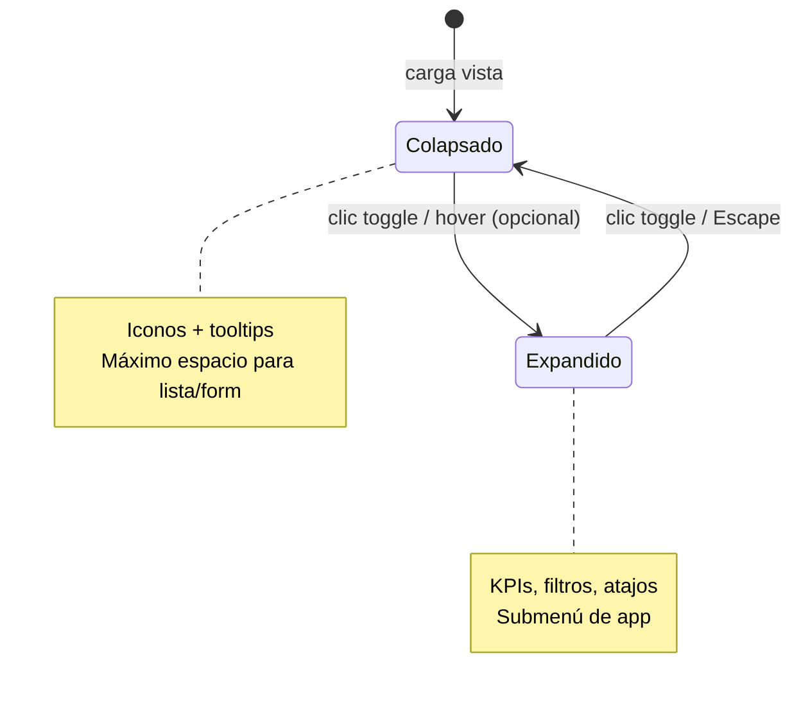
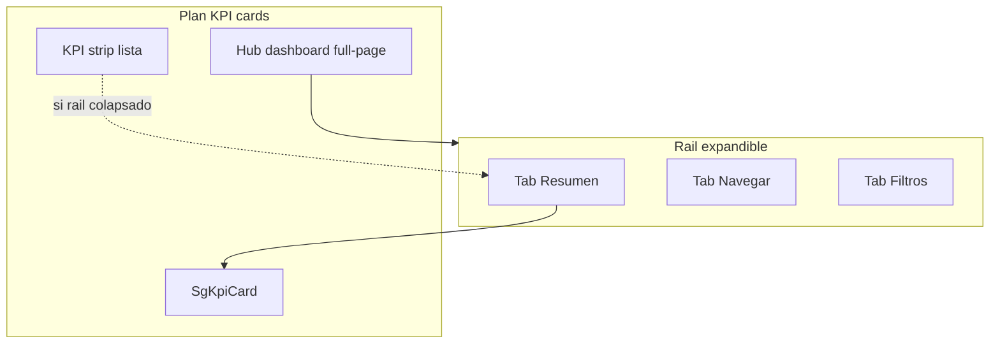

# Plan — Rail expandible para interacciones Odoo

**Estado:** planificado · **Fecha:** 2026-07-03  
**Relacionado:** [plan-liquid-glass-kpi-routes.md](./plan-liquid-glass-kpi-routes.md) · [plan-rail-expandible-odoo.md](./plan-rail-expandible-odoo.md) · [plan-hub-rail-kpi-ingreso.md](./plan-hub-rail-kpi-ingreso.md) · [liquid-glass-odoo.md](../design/liquid-glass-odoo.md) · [ADR 0001](../adr/0001-liquid-glass-odoo-frontend.md)

---

## 1. Concepto

Un **rail expandible** es una barra vertical fija (izquierda o derecha) que en estado **colapsado** muestra solo iconos (~56 px) y en estado **expandido** revela etiquetas, subnavegación, KPIs, filtros o acciones secundarias (~260–320 px).



### Objetivo en Servigas

Mover **interacciones secundarias y contextuales** fuera del área principal de trabajo, sin reemplazar botones primarios ni filas de listas. Complementa el plan de KPI cards: el rail es el **contenedor**; las KPI cards son **contenido** del rail expandido.

---

## 2. Evaluación de la idea

### 2.1 ¿Tiene sentido para Servigas?

| Criterio | Evaluación |
|----------|------------|
| Canal principal POS | El POS ya tiene paneles fijos (línea pedido / productos). **Rail solo en backend.** |
| Catálogo 8.767 SKU | Listas necesitan ancho. Rail colapsado por defecto en listas. |
| Usuarios mostrador | Pocos usuarios backend; curva de aprendizaje baja si rail es opcional. |
| Design system Liquid Glass | Encaja: superficie glass lateral, canvas continuo en contenido. |
| Odoo estándar | Menús y control panel ya existen. Rail **complementa**, no duplica todo. |

**Veredicto:** **Sí, de forma acotada** — rail contextual en vistas seleccionadas, no reemplazo total del shell Odoo.

### 2.2 Qué NO debe ir en el rail

| Interacción | Motivo | Dónde queda |
|-------------|--------|-------------|
| Guardar / Descartar | CTA primario | Barra de formulario |
| Crear / Nuevo | CTA primario | Control panel lista |
| Cobrar (POS) | CTA primario | POS footer |
| Statusbar (Confirmar, Validar) | Workflow visible | Form header |
| Filas de lista | Lista densa | Área principal |
| Chatter / mensajes | Ya tiene panel Odoo | Derecha del form (no duplicar) |
| Búsqueda principal | Debe ser prominente | Command bar superior o rail tab «Buscar» solo si no compite |

### 2.3 Qué SÍ puede ir en el rail

| Interacción | Rail | Prioridad |
|-------------|------|-----------|
| KPIs resumen (cards compactas) | Expandido, tab «Resumen» | Alta |
| Atajos a subvistas (Productos, Movimientos, Informes) | Expandido, tab «Navegar» | Alta |
| Filtros guardados / favoritos | Expandido, tab «Filtros» | Media |
| Registros recientes | Expandido, tab «Recientes» | Media |
| Acciones secundarias (exportar, duplicar) | Expandido, tab «Acciones» | Baja |
| Cambio rápido de app | Colapsado, iconos | Media |
| Submenú de app actual | Expandido | Media |

---

## 3. Variantes evaluadas

### Variante A — Rail izquierdo global (navegación)

```
┌──┬────────────────────────────────────────┐
│🏠│  Navbar reducido / command bar         │
│📦│  ┌──────────────────────────────────┐  │
│🛒│  │  Contenido principal             │  │
│💰│  │  (lista / form / dashboard)      │  │
│⚙│  └──────────────────────────────────┘  │
└──┴────────────────────────────────────────┘
 ↑ rail colapsado / expandido
```

| Pros | Contras |
|------|---------|
| Look moderno tipo VS Code / Linear | Duplica `ir.ui.menu` y navbar Odoo |
| Libera espacio en navbar superior | Alto esfuerzo de sincronización menús |
| Iconos de app siempre visibles | Confuso si convive con app switcher nativo |

**Decisión:** **Fase 2 opcional.** No reemplazar navbar en v1.

---

### Variante B — Rail derecho contextual (recomendada v1)

```
┌────────────────────────────────────────┬──┐
│  Command bar / control panel           │📊│
│  ┌──────────────────────────────────┐  │🔍│
│  │  Contenido principal             │  │⚡│
│  │                                  │  │◀│ toggle
│  └──────────────────────────────────┘  └──┘
└────────────────────────────────────────┘
                              rail derecho
```

| Pros | Contras |
|------|---------|
| No compite con menús Odoo | En forms con chatter, pantalla estrecha |
| Contenido según vista activa | Requiere parche por tipo de vista |
| Colapsado = casi sin costo de ancho | Dos paneles derechos si no se coordina con chatter |

**Decisión:** **Piloto v1** en hubs y listas operativas.

---

### Variante C — Shell completo (ViewShell)

Rail izquierdo + command bar + rail derecho; navbar Odoo mínima.

| Pros | Contras |
|------|---------|
| Máxima coherencia Liquid Glass v2 | Máximo riesgo en upgrades |
| Paridad con CRM Astor | Contradice regla «no forzar ViewShell en CRUD simple» |

**Decisión:** **No** para listas CRUD estándar. Solo en **client actions custom** (hubs dashboard).

---

### Variante elegida: **B + C híbrido progresivo**

| Contexto | Shell |
|----------|-------|
| Hub dashboard (Inventario, Ventas) | ViewShell: rail izq navegación + contenido + rail der opcional |
| Listas operativas (productos, pedidos) | Rail derecho contextual colapsado por defecto |
| Formularios con chatter | Sin rail derecho; KPIs en stat buttons |
| POS | Sin rail (paneles nativos) |
| Ajustes | Sin rail |

---

## 4. Inventario de interacciones Odoo por ubicación

### 4.1 Interacciones nativas Odoo (hoy)

| Ubicación DOM | Interacciones | ¿Mover al rail? |
|---------------|---------------|-----------------|
| `.o_main_navbar` | App switcher, menús sección, usuario | Parcial — solo atajos app en rail izq (fase 2) |
| `.o_control_panel` | Búsqueda, filtros, agrupar, favoritos, Creado | Filtros/favoritos → tab rail «Filtros» (opcional) |
| `.o_list_buttons` | Crear, Importar | **No** — quedan en control panel |
| `.o_cp_action_menus` | Acciones, Imprimir | Tab «Acciones» en rail (secundario) |
| `.o_form_statusbar` | Workflow | **No** |
| `.oe_button_box` | Stat buttons | **No** — mini KPI en form (plan KPI) |
| `.o-mail-Chatter` | Mensajes, actividades | **No** — panel nativo |
| `.o_searchview` | Dominio de búsqueda | Duplicar favoritos en rail, no la barra principal |

### 4.2 Mapa rail por ruta

| Ruta | Rail izq | Rail der | Tabs rail der | Estado colapsado default |
|------|----------|----------|---------------|--------------------------|
| Hub Inventario | ● Navegación app | ◐ KPIs | Resumen · Navegar · Filtros | Expandido ≥1440px |
| Productos (lista) | ○ | ● | Resumen · Filtros · Recientes | **Colapsado** |
| Producto (form) | ○ | ○ | — (usar stat buttons + chatter) | — |
| Transferencias (lista) | ○ | ◐ | Resumen · Filtros | Colapsado |
| Hub Ventas | ● | ◐ | Resumen · Navegar | Expandido ≥1440px |
| Pedidos (lista) | ○ | ◐ | Resumen · Filtros | Colapsado |
| Hub Compras | ● | ◐ | Resumen · Navegar | Expandido ≥1440px |
| OC (lista) | ○ | ◐ | Resumen · Filtros | Colapsado |
| Facturas (lista) | ○ | ○ | Solo si no hay chatter conflict | Colapsado |
| Factura (form) | ○ | ○ | No — chatter ocupa derecha | — |
| Informes / pivot | ○ | ● | Resumen · Dimensiones | Expandido |
| POS sesión | — | — | **Sin rail** | — |
| Ajustes | ○ | ○ | No | — |

Leyenda: ● = sí · ◐ = parcial · ○ = no

---

## 5. Diseño del componente

### 5.1 Anatomía

```
.sg-rail
├── .sg-rail--collapsed | .sg-rail--expanded
├── .sg-rail__toggle          # botón ◀ / ▶
├── .sg-rail__icons           # columna iconos (siempre visible)
│   └── .sg-rail__icon[data-tab]
└── .sg-rail__panel           # panel glass expandible
    ├── .sg-rail__header      # título tab activo
    └── .sg-rail__body        # scroll único del panel
        ├── .sg-glass-kpi     # reutiliza plan KPI
        ├── .sg-rail-nav      # links subvista
        └── .sg-rail-filters  # favoritos
```

### 5.2 Tokens y clases SCSS

| Clase | Propósito |
|-------|-----------|
| `.sg-rail` | Contenedor fixed/sticky lateral |
| `.sg-rail--left` / `.sg-rail--right` | Lado |
| `.sg-rail--collapsed` | Ancho `--sg-rail-width-collapsed` (56px) |
| `.sg-rail--expanded` | Ancho `--sg-rail-width-expanded` (280px) |
| `.sg-rail__panel` | `@include sg-glass-surface` |
| `.sg-rail-layout` | Wrapper flex: contenido + rail |
| `.sg-rail-layout__main` | `flex: 1; min-width: 0` |

Variables propuestas en `servigas_tokens.scss`:

```scss
:root {
  --sg-rail-width-collapsed: 3.5rem;
  --sg-rail-width-expanded: 17.5rem;
  --sg-rail-transition: 220ms ease;
  --sg-rail-z: 100;
}
```

### 5.3 Comportamiento UX

| Regla | Detalle |
|-------|---------|
| Persistencia | `localStorage` clave `sg_rail_expanded_<view_id>` |
| Teclado | `[` colapsar · `]` expandir · `Escape` colapsar |
| Motion | `transform` + `width`; respetar `prefers-reduced-motion` |
| Móvil / tablet | Rail como **overlay** (no empuja contenido); backdrop semitransparente |
| ≥1280px | Rail empuja contenido (layout flex) |
| Chatter visible | Ocultar rail der automáticamente en form views |

---

## 6. Arquitectura técnica Odoo 19

### 6.1 Componentes OWL

```
servigas_core/static/src/js/
├── rail/
│   ├── sg_rail.js              # Componente rail reutilizable
│   ├── sg_rail.xml
│   ├── sg_rail_layout.js       # Wrapper contenido + rail
│   └── sg_rail_service.js      # Estado global expand/collapse
├── rail/tabs/
│   ├── summary_tab.js          # KPI cards compactas
│   ├── navigate_tab.js         # Links ir.actions
│   ├── filters_tab.js          # Favoritos search view
│   └── recents_tab.js          # Registros recientes (opcional)
└── patches/
    ├── list_view_rail_patch.js # Inyecta rail en ListController
    └── hub_shell_patch.js      # ViewShell para client actions
```

### 6.2 Puntos de integración Odoo

| Punto | Mecanismo | Uso |
|-------|-----------|-----|
| Hub dashboard | `ir.actions.client` con layout propio | ViewShell completo |
| Listas seleccionadas | `patch(ListController)` o extensión | Rail der contextual |
| Formularios | **No parchear** por defecto | Evitar conflicto chatter |
| Registro componente | `registry.category("actions")` | Hubs |
| Menús rail izq | Leer `ir.ui.menu` vía RPC `load_menus` | Fase 2 |

### 6.3 API del servicio rail

```javascript
// sg_rail_service.js — contrato propuesto
{
  isExpanded(viewKey): boolean,
  toggle(viewKey): void,
  setTab(viewKey, tabId): void,
  getTabsForAction(actionId): TabConfig[],
}
```

### 6.4 Configuración por vista (XML / Python)

```xml
<!-- views/rail_config.xml -->
<record id="rail_config_product_list" model="servigas.rail.config">
    <field name="action_id" ref="stock.product_template_action"/>
    <field name="position">right</field>
    <field name="default_collapsed" eval="True"/>
    <field name="tab_ids" eval="[(6, 0, [ref('tab_summary'), ref('tab_filters')])]"/>
</record>
```

Modelo ligero `servigas.rail.config` para activar rail por `ir.actions.act_window` sin hardcodear en JS.

---

## 7. Contenido por tab del rail

### Tab «Resumen»

Reutiliza `SgKpiCard` del plan KPI en formato compacto (2 columnas dentro del rail).

| Vista | KPIs en rail |
|-------|--------------|
| Productos | Total activos, bajo stock, sin precio |
| Pedidos | Borrador, confirmados hoy, monto día |
| OC | Pendientes recepción, enviadas |
| Transferencias | En espera, listas hoy |

### Tab «Navegar»

Links a acciones relacionadas de la misma app (menú lateral humanizado).

**Inventario expandido:**

- Productos
- Categorías
- Transferencias
- Ajustes
- Valoración stock

### Tab «Filtros»

- Favoritos de `ir.filters` del usuario
- Filtros rápidos predefinidos (bajo stock, activos, etc.)
- Al clic: aplica dominio en la lista sin abrir panel búsqueda Odoo

### Tab «Recientes» (opcional)

- Últimos 8 registros abiertos en esa vista (`action_id` + `res_id` en sessionStorage)

### Tab «Acciones» (baja prioridad)

- Exportar, duplicar, eliminar — acciones del menú engranaje que hoy están en control panel

---

## 8. Relación con plan KPI cards



| Elemento plan KPI | Con rail | Sin rail |
|-------------------|----------|----------|
| Hub dashboard full-page | Hub **con** rail izq navegación | Grid KPI centrado |
| KPI strip en lista | **Opcional** — strip o tab Resumen | Strip bajo control panel |
| Stat buttons form | Sin cambio | Sin cambio |

**Recomendación:** en listas, **elegir uno**: KPI strip horizontal **o** tab Resumen en rail — no ambos a la vez.

---

## 9. Fases de implementación

### Fase R0 — Fundación SCSS rail

- Variables `--sg-rail-*`
- Clases `.sg-rail`, `.sg-rail-layout`
- `servigas_rail.scss` en manifest
- **Sin OWL** — solo markup estático en hub mock

### Fase R1 — Componente `SgRail` + servicio

- Toggle expand/collapse con persistencia
- Tabs iconos + panel glass
- Tests manuales en client action vacío

### Fase R2 — Hub Inventario con ViewShell

- Rail izq: navegación Inventario
- Centro: grid KPI (plan Fase 2 KPI)
- Rail der opcional: tab Filtros
- **Integra** plan KPI Fase 2

### Fase R3 — Listas piloto con rail der

- Parche `ListController` para `product.template` lista
- Tabs: Resumen + Filtros
- Colapsado por defecto
- Evaluar si reemplaza KPI strip

### Fase R4 — Más listas + modelo config

- `servigas.rail.config` en Python
- Pedidos, OC, transferencias
- Activación por XML sin tocar JS

### Fase R5 — Rail izq global (opcional)

- Iconos de app en rail izq
- Sincronizar con menús Odoo
- Toggle usuario «navbar clásica / rail»

### Fase R6 — Pulido responsive

- Overlay en tablet
- Coordinación con chatter (detección ancho)

---

## 10. Matriz esfuerzo / riesgo / valor

| Fase | Esfuerzo | Valor UX | Riesgo upgrade | Dependencias |
|------|----------|----------|----------------|--------------|
| R0 SCSS | Bajo | Bajo | Mínimo | `servigas_tokens.scss` |
| R1 Componente | Medio | Medio | Medio | R0 |
| R2 Hub ViewShell | Medio-alto | **Alto** | Medio | Plan KPI Fase 0–2, R1 |
| R3 Lista piloto | Alto | **Alto** | **Alto** (patch ListController) | R1, KPI cards |
| R4 Config XML | Medio | Medio | Medio | R3 validado |
| R5 Rail izq global | Alto | Medio | Alto | R2 |
| R6 Responsive | Medio | Medio | Bajo | R3 |

---

## 11. Riesgos y mitigaciones

| Riesgo | Impacto | Mitigación |
|--------|---------|------------|
| Patch `ListController` rompe en Odoo 19.x | Alto | Aislar patch; feature flag por vista; tests smoke |
| Rail + chatter = pantalla estrecha | Medio | Desactivar rail der en forms; breakpoint 1280px |
| Duplicar filtros (rail + searchview) | Medio | Rail solo favoritos; búsqueda libre queda arriba |
| Usuario no descubre rail colapsado | Medio | Tooltip en iconos; primer uso — hint dismissible |
| Doble scroll en panel rail | Medio | `.sg-rail__body` único scroll; regla flex chain |
| POS afectado por CSS global | Alto | Scope estricto `.o_web_client .sg-rail`; no assets POS |

---

## 12. Criterios de aceptación

```
Rail expandible — <vista>:
- [ ] Colapsado por defecto en listas (salvo hub)
- [ ] Expande/colapsa sin perder estado de lista
- [ ] Un solo scroll en panel rail
- [ ] Glass solo en panel, no en iconos sueltos
- [ ] prefers-reduced-motion respetado
- [ ] No visible en POS ni en forms con chatter
- [ ] KPI tab usa SgKpiCard (no duplicar markup)
- [ ] Persistencia preferencia en localStorage
- [ ] Prueba 1280px, 1440px, tablet overlay
```

---

## 13. Orden recomendado con plan KPI

Ejecutar en paralelo secuencial:

```
Plan KPI Fase 0 (SCSS dashboard)
        ↓
Plan KPI Fase 2 (SgKpiCard + hub)  +  Rail R0–R1 (componente)
        ↓
Rail R2 (Hub Inventario ViewShell)  ← usa SgKpiCard en centro + rail
        ↓
Rail R3 (lista productos piloto)    ← decide strip vs tab Resumen
        ↓
Plan KPI Fase 4 (strips otras listas) solo si R3 no cubre con rail
```

**No iniciar R5 (rail izq global)** hasta validar R2–R3 con usuarios.

---

## 14. Decisión resumida

| Pregunta | Respuesta |
|----------|-----------|
| ¿Rail en todas las rutas? | **No** — hubs, listas clave, informes |
| ¿Rail en POS? | **No** |
| ¿Rail en forms? | **No** (chatter + stat buttons) |
| ¿Izquierda o derecha? | **Derecha** contextual v1; **izquierda** solo en hubs v2 |
| ¿Reemplaza navbar Odoo? | **No** en v1 |
| ¿Contenedor de KPI cards? | **Sí** — tab Resumen del rail |

---

*Documento generado: 2026-07-03*
