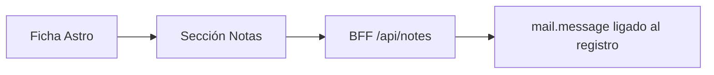
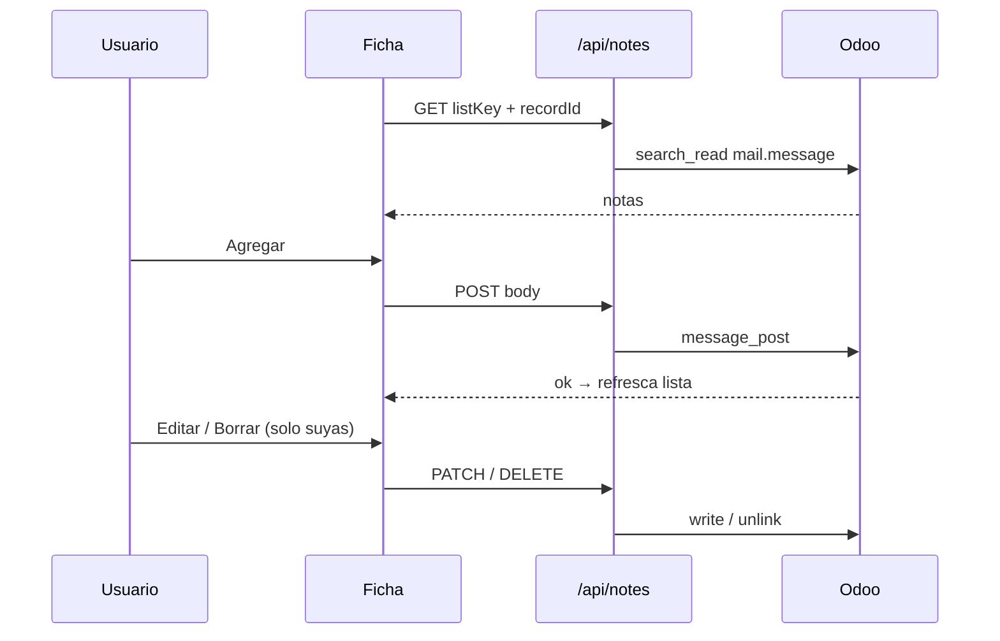

# Design: Bitácora de notas en fichas Astro

**Fecha:** 2026-07-23  
**Estado:** implemented  
**Repo:** servigas / `web/` (+ Odoo vía BFF)

> **Implementación (2026-07-23):** Mergeado a `main` (`491cfe7`). Suite automatizada verde + smoke manual contra Odoo live OK (agregar/editar/borrar propia, permisos de autor, bloque Notas en fichas v1).

## Problema

Las fichas del shell Astro (cliente, proveedor, producto, pedido, etc.) muestran datos y edición básica, pero no hay un lugar para dejar **comentarios operativos internos** con historial (quién dijo qué y cuándo). El chatter nativo de Odoo se evita en la UX operativa; hace falta una bitácora simple en Astro.

## Decisión

Bitácora interna reutilizando **`mail.message`** de Odoo, expuesta por un BFF dedicado y una sección UI compartida en las fichas.

| Tema | Elección |
|------|----------|
| Forma | Varias entradas (append + edit/delete del autor) |
| Alcance v1 | Clientes, proveedores, productos, cotizaciones, pedidos de venta, OC/solicitudes de compra |
| Permisos | Cualquier usuario logueado crea; solo el autor edita/borra la suya |
| Visibilidad | Solo interna (nunca portal / PDF / cliente) |
| Almacenamiento | `mail.message` del registro (no modelo `servigas.note` paralelo) |

### Analogía

Cada ficha tiene un **cuaderno compartido**: el papel vive en Odoo; Astro solo muestra y escribe con una API chica.

## Arquitectura

- **Fuente de verdad:** mensajes internos del registro (notas/comentarios), no emails ni logs automáticos del sistema.
- **Resolución de modelo:** `listKey` existente (`sales/customers`, `inventory/products`, etc.) → modelo Odoo vía `getRecordListDef` / allowlist de notas.
- **No mezclar** notas con `/api/records` (CRUD de campos de ficha).

## Allowlist v1

Una nota es válida solo si el `listKey` resuelve a uno de estos modelos **y** la ficha `[id]` está cableada (ver UI):

| Modelo Odoo | listKeys que lo usan (no exhaustivo; basta el modelo) |
|-------------|------------------------------------------------------|
| `res.partner` | `sales/customers`, `purchase/vendors`, y listas que reutilicen esas fichas |
| `product.template` | `inventory/products` (no variantes `product.product` en v1) |
| `sale.order` | cotizaciones / pedidos (`sales/quotations`, `sales/orders`, etc.) |
| `purchase.order` | OC / solicitudes (`purchase/orders`, `purchase/solicitudes`, etc.) |

Cualquier otro modelo o `listKey` sin ficha cableada → 404.

## Contrato de datos

Payload de nota hacia Astro:

| Campo | Tipo | Notas |
|-------|------|--------|
| `id` | number | Id `mail.message` |
| `body` | string | Texto plano (HTML de Odoo se normaliza a texto al leer/escribir) |
| `authorName` | string | Display name |
| `authorId` | number | `author_id` / uid |
| `createdAt` | string | ISO-8601 UTC (el adapter normaliza desde datetime Odoo) |
| `canEdit` | boolean | `authorId === uid` de la sesión BFF |

### Filtro Odoo (notas internas)

Al listar: mensajes del `res_model` + `res_id` del registro que sean notas/comentarios internos (excluir emails entrantes/salientes y notificaciones de sistema). Detalle exacto de dominio (`message_type` / subtype) se fija en el plan de implementación contra la versión Odoo del stack; el criterio de producto es: **solo bitácora humana interna**.

## API BFF — `/api/notes`

| Método | Body / query | Efecto |
|--------|--------------|--------|
| `GET` | `listKey`, `recordId` | Lista notas; **más nuevas primero** |
| `POST` | `{ listKey, recordId, body }` | Crea nota; autor = usuario sesión (`message_post` o equivalente) |
| `PATCH` | `{ id, body }` | Edita si autor; si no → 403 |
| `DELETE` | `{ id }` | Borra si autor; si no → 403 |

### Validación

- `body` obligatorio tras `trim`; vacío → 400 (“Escribí una nota”).
- Máx. ~4000 caracteres → 400 (“La nota es demasiado larga”).
- `recordId` inválido / registro inexistente / `listKey` fuera de allowlist → 404.
- Edit/delete ajeno → 403 (“Solo podés editar tus propias notas”).
- Sesión / Odoo: mismos códigos que el resto del BFF (401/503 + copy seguro).

## UI

Componente reutilizable (p. ej. `RecordNotes.astro` + script isla o fetch en página) al **final de la ficha**, después de edit/archive.

1. Título **Notas**
2. Textarea + **Agregar**
3. Lista: autor, fecha corta, texto; si `canEdit` → **Editar** / **Borrar**
4. Vacío: “Todavía no hay notas en esta ficha.”

### UX

- Tras agregar: limpia textarea; la nota nueva aparece arriba.
- Editar: modo inline (Guardar / Cancelar).
- Borrar: confirmación corta (“¿Borrar esta nota?”).
- Errores acotados al bloque Notas; no tumban el resto de la ficha.
- Sin menciones, adjuntos ni rich text en v1.
- Estilo alineado al shell glass existente (sin card hero suelta).

### Fichas a cablear en v1

- `lists/sales/customers/[id].astro`
- `lists/purchase/vendors/[id].astro`
- `lists/inventory/products/[id].astro`
- `lists/sales/quotations/[id].astro`
- `lists/sales/orders/[id].astro`
- `lists/purchase/orders/[id].astro` (y solicitudes si comparten ficha/modelo `purchase.order`)

## Flujo

## Testing

- Contrato BFF: filtro internas, `canEdit` por autor, validación body, deny edit/delete ajeno, allowlist.
- Adapter con mock Odoo: list/create/edit/delete.
- Smoke opcional en ficha: agregar → aparece; editar propia; borrar ajena no disponible.

## No-objetivos (v1)

- Adjuntos, @menciones, rich text / HTML editable
- Notas visibles en portal o impresas en PDF
- Modelo Odoo custom `servigas.note`
- Bitácora global fuera de la ficha
- Restaurar chatter OWL completo en formularios operativos

## Criterios de éxito

1. En una ficha v1, un usuario agrega una nota y la ve con su nombre y fecha.
2. Otro usuario ve la nota pero no tiene Editar/Borrar.
3. El autor puede editar y borrar la suya.
4. La nota queda en Odoo como mensaje interno del registro (visible si se inspecciona el hilo nativo).
5. Fallos de red/validación no rompen la ficha; solo el bloque Notas.

## Enfoques descartados

| Enfoque | Por qué no |
|---------|------------|
| Campo texto único (`comment` / `note`) | No es bitácora; se sobrescribe |
| Modelo `servigas.note` paralelo | Doble verdad vs chatter Odoo; más superficie |
| Chatter OWL completo | Ya se evita en UX operativa; demasiado ruido |
