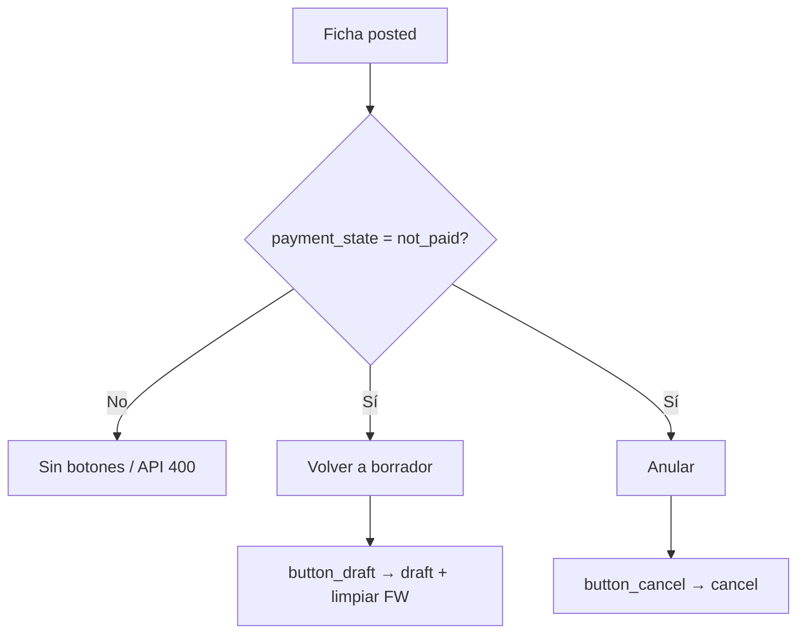

# Design: Volver a borrador / Anular FC·FP·NC (P1.1)

**Fecha:** 2026-07-25  
**Estado:** approved  
**Repo:** servigas (`web/`)  
**Relacionado:** publish (`record-actions` / `action_post`) · edit draft (P1.2) · Factura Web (P1.5)

## Meta

Desde la ficha Astro, deshacer una publicación: **volver a borrador** o **anular**, sin dejar saldo inconsistente.

## Decisiones

| Decisión | Elección |
|----------|----------|
| Acciones | Ambas: `button_draft` + `button_cancel` |
| Comprobantes | FC, NC cliente, FP, NC proveedor |
| Cobros/pagos | Bloquear si `payment_state !== not_paid` |
| Arquitectura | Módulo `invoice-lifecycle.ts` + acciones API dedicadas |

## Comportamiento

| Pieza | Detalle |
|-------|---------|
| Listas | `accounting/customer-invoices`, `credit-notes`, `vendor-bills`, `vendor-refunds` |
| UI | Ficha: botones solo si `state === posted` **y** `payment_state === not_paid` |
| Confirm | Textos distintos: “¿Volver a borrador?” / “¿Anular este comprobante?” |
| API | `reset_invoice_draft` · `cancel_invoice` (`POST /api/records/{listKey}`) |
| Guard BFF | `posted` + `not_paid` + `move_type` del allowlist; si no → 400 |
| Odoo | `button_draft` / `button_cancel` |
| Post-reset | Tras `button_draft` exitoso: si había FW, write `sg_fw_loaded=false`, `sg_fw_number=false`, `sg_fw_loaded_at=false` |

## Analogía

Publicar = firmar el ticket.  
**Volver a borrador** = borrar la firma y corregir.  
**Anular** = invalidar el ticket.  
Si ya cobraste, primero devolvé la plata — no rasgás el papel a medias.

## Flujo

## Fuera de alcance

- Bulk reset/cancel  
- Ficha `accounting/drafts` (usar fichas tipadas)  
- Deshacer cobros/pagos desde este botón  
- Reabrir cancelado  
- AFIP / CAE  

## Criterios de aceptación

1. FC posted unpaid → Volver a borrador → `draft`; se puede editar/publicar.  
2. FC posted con cobro (`partial`/`paid`/`in_payment`) → botones no / API 400.  
3. FC posted unpaid → Anular → `cancel`.  
4. Mismo comportamiento en NC, FP y NC proveedor.  
5. Tras reset, flags Factura Web limpios si estaban marcados.  
6. Tests: helpers allowlist/guard + adapter + UI wired en fichas.
