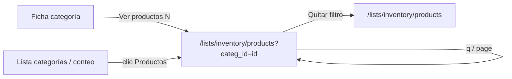

# Diseño — Ver productos de una categoría

**Fecha:** 2026-08-03  
**Estado:** Aprobado (conversación)  
**Proyecto:** Servigas (Odoo 19 Community + Astro BFF)  
**Alcance:** Desde Categorías, abrir el listado de Productos filtrado por esa categoría exacta

## Resumen

En la ficha (y el conteo de la lista) de una categoría, el usuario puede ir al listado existente de Productos ya filtrado por `categ_id` exacto. Se reutiliza la tabla, búsqueda y paginación actuales; no hay lista embebida en la ficha.

## Decisiones

| Tema | Elección |
|------|----------|
| UX | Link al listado de productos (opción A), no tabla embebida |
| Alcance del filtro | Solo categoría exacta (`categ_id = id`), no `child_of` |
| Mecánica | Query `?categ_id={id}` en `/lists/inventory/products` |
| Allowlist | Solo la lista `inventory/products` acepta el param |
| Param inválido | Se ignora (sin 400); listado sin filtro de categoría |
| Conteo clickeable | Celda `product_count` en lista de categorías → mismo URL |

## Flujo UX

1. Ficha categoría: CTA **“Ver productos (N)”** → `/lists/inventory/products?categ_id={id}`.
2. Listado Productos: dominio base (`active=true`) + `["categ_id","=",id]` + búsqueda `q` si hay.
3. Banner: *Productos de “{nombre}”* + enlace **Quitar filtro**.
4. Búsqueda y paginación conservan `categ_id`.
5. Lista categorías: celda `product_count` navega al URL filtrado; el resto de columnas sigue a la ficha.

## Datos / API / seguridad

- Extender `RecordListQuery` con `categId?: number`.
- Aplicar el clause solo si `listKey === "inventory/products"` y `categId` es entero > 0.
- Página `lists/[...slug].astro` y `GET /api/lists/[...slug]` leen `categ_id` del query string y lo pasan al backend.
- `ListToolbar` preserva `categ_id` (hidden + `hrefFor`).
- Nombre en el banner: read de `product.category` (nombre / `complete_name`); si falla, banner genérico sin nombre.
- No se aceptan dominios arbitrarios desde el cliente.

## UI — puntos de cambio

| Superficie | Cambio |
|------------|--------|
| `categories/[id].astro` | CTA con count hacia productos filtrados |
| `lists/[...slug].astro` (products) | Leer `categ_id`, banner, pasar query al BFF |
| `ListToolbar.astro` | Preservar `categ_id` |
| `RecordTable.astro` | `product_count` → `/lists/inventory/products?categ_id={row.id}` cuando aplica |
| `record-lists.ts` / adapter | `categId` en query + dominio |

## Fuera de v1

Embed de productos en la ficha; filtro `child_of`; filtros genéricos en otras listas; cambiar el purge.

## Criterios de aceptación

1. Desde la ficha, “Ver productos” muestra solo productos con ese `categ_id` exacto; el total es coherente con el conteo de la categoría.
2. Buscar y paginar no pierden `categ_id`.
3. “Quitar filtro” vuelve a `/lists/inventory/products` sin el param.
4. Clic en el número de Productos en la lista de categorías abre el mismo listado filtrado.
5. Param inválido o ausente no rompe el listado (se comporta como hoy).
6. Tests unitarios cubren dominio con/sin `categId` y con `q` combinado.

## Tests

- Extender tests de `buildSearchDomain` / helper de filtro: válido, inválido, otra lista, combinación con `q`.
- Gates: `npm test` (y typecheck/build según el plan de implementación).
