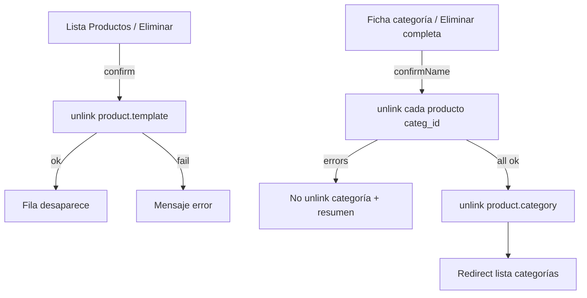

# Diseño — Borrado duro de producto (lista) y categoría completa

**Fecha:** 2026-08-03  
**Estado:** Aprobado (conversación)  
**Proyecto:** Servigas (Odoo 19 Community + Astro BFF)  
**Alcance:** Botón Eliminar por fila en listado de Productos (hard delete); botón en ficha de categoría que elimina todos sus productos y luego la categoría

## Resumen

El usuario necesita sacar del catálogo productos y categorías de forma definitiva (no archivar). En el listado de Productos cada fila tiene un botón **Eliminar** que hace `unlink`. En la ficha de categoría, **Eliminar categoría completa** borra duro todos los productos con ese `categ_id` y, solo si ninguno falla, borra la categoría.

## Decisiones

| Tema | Elección |
|------|----------|
| Producto en lista | Hard delete (`unlink`); siempre visible en `inventory/products` |
| Si `unlink` producto falla | Error visible; **sin** fallback a archivar |
| Categoría completa | Hard-purge productos → luego `unlink` categoría |
| Si algún producto falla en purge de categoría | No se borra la categoría; se reporta resumen |
| Confirmación producto | `window.confirm` con nombre |
| Confirmación categoría | Escribir el nombre (mismo patrón que purge) |
| Purge híbrido existente | Se mantiene; el botón nuevo es el destructivo |

## Flujo UX

## Datos / API / seguridad

### Allowlist

- Introducir `canHardDelete(listKey)`: `inventory/products`, `inventory/categories` (y OT existentes).
- `POST /api/records/[...slug]` `action: "delete"` y `OdooAdapter.deleteRecord` usan `canHardDelete` (dejar de depender solo de `canDeleteWorkOrder`).

### Producto (fila)

- `POST /api/records/inventory/products` `{ action: "delete", id }`
- UI: columna acción opt-in en `RecordTable` + host JS en página de lista de productos.
- Modelo: `product.template` vía def de lista.

### Categoría completa

- Extender `POST /api/inventory/products/purge-by-category` con `action: "delete-category"` (o endpoint hermano equivalente):
  1. Validar categoría + `confirmName`
  2. Hard-unlink cada `product.template` con `categ_id` exacto (sin archive)
  3. Si `errors.length > 0` → no tocar categoría; devolver `{ deleted, errors }`
  4. Si OK → `unlink` `product.category` → UI redirect `/lists/inventory/categories`
- Helper puro: `hardPurgeIds` (solo unlink; acumula errores) reutilizable en tests.

## UI — puntos de cambio

| Superficie | Cambio |
|------------|--------|
| `RecordTable.astro` | Columna opcional delete por fila |
| `lists/[...slug].astro` | Activar delete host en `inventory/products` |
| `categories/[id].astro` | CTA Eliminar categoría completa + confirm nombre |
| `record-writes` / workshop delete gate | `canHardDelete` unificado |
| `purge-by-category` API + adapter | `delete-category` hard path |

## Fuera de v1

Borrado masivo por checkbox; soft-delete; borrar subcategorías hijas (`child_of`); quitar el purge híbrido.

## Criterios de aceptación

1. En `/lists/inventory/products`, cada fila tiene Eliminar; confirma y hace `unlink` (o falla en claro sin archivar).
2. En ficha categoría, Eliminar categoría completa exige el nombre.
3. Si algún producto no se puede `unlink`, la categoría permanece y se informa.
4. Si todos los productos se eliminan, la categoría desaparece y se vuelve a la lista.
5. Listas sin allowlist no aceptan `action: "delete"`.
6. Tests unitarios cubren allowlist, hard purge y shell UI.

## Tests

- `canHardDelete` allowlist.
- Hard purge: todos OK / parcial con errores (sin unlink categoría).
- Delete producto adapter: unlink fail → no archive.
- Shell UI: botón en lista productos + CTA en ficha categoría.
- Gates: `npm test` y `npm run build`.
