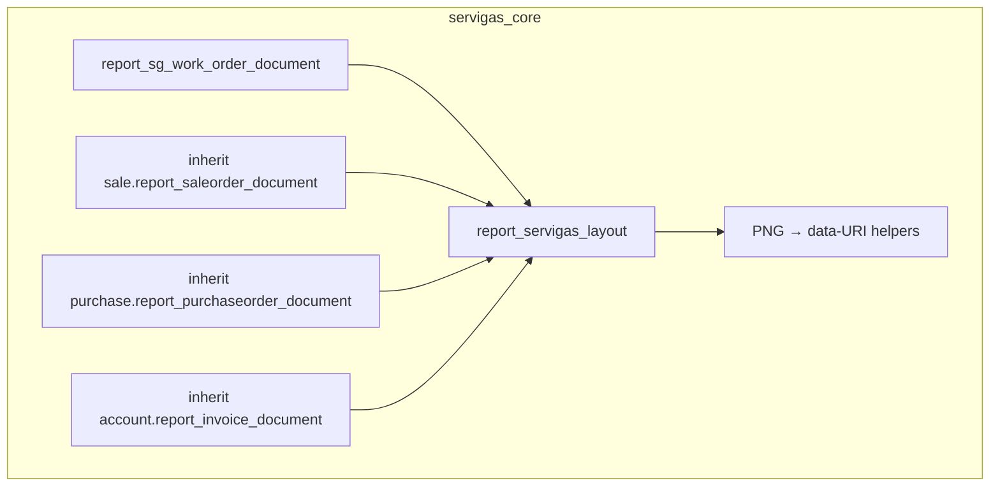

# Design: Layout PDF Servigas unificado (OT + SO + PO + facturas)

**Fecha:** 2026-08-05  
**Estado:** draft (pending user review)  
**Repo:** servigas (`custom_addons/servigas_core` + proxy BFF existente)  
**Base:** [2026-08-03-workshop-work-order-share-design.md](./2026-08-03-workshop-work-order-share-design.md)

## Problema

Solo la orden de trabajo genera un PDF con marca Servigas (logo, borde naranja, tipografía DejaVu, pie). Pedidos/cotizaciones, órdenes de compra/RFQ y facturas/NC/bills usan `web.external_layout` de Odoo y salen con membrete genérico (“My Company, United States”, etc.). El shell Astro ya proxya y envía esos PDFs; el problema es el look del reporte QWeb.

## Meta

Un solo “marco de carta” Servigas para todos los PDFs que el shell muestra o envía: OT, sale order/quotation, purchase order, invoice (cliente, proveedor, NC, refunds, drafts). Contenido comercial (líneas, impuestos, totales) sigue siendo el de Odoo; no se inventan campos.

## Decisiones

| Tema | Decisión |
|------|----------|
| Alcance documentos | OT + pedidos/cotizaciones + OC/RFQ + facturas/NC/bills/drafts |
| Profundidad visual | Membrete Servigas + retoque tipográfico/secciones (no rediseño total por modelo) |
| Layout | QWeb compartido `servigas_core.report_servigas_layout`; OT migra a usarlo |
| Enfoque técnico | Layout propio + inherit de templates document estándar (no heredar `web.external_layout` global) |
| BFF / XMLIDs de report | Sin cambios: mismos endpoints y mismos `ir.actions.report` |
| Mail | Sin cambio de `mail.template`; el adjunto hereda el look nuevo del report |
| Marca | `servigas_mark_print.png` embebido como data-URI (patrón OT) |
| Pie v1 | Mínimo: “Servigas” (como OT); sin bloque largo de contacto |

## Arquitectura

```
Ficha / Ver PDF / Enviar mail (Astro)
  └─ BFF /api/reports/*  o  mail.template.send_mail
       └─ Odoo /report/pdf/<xmlid>/:id
            └─ QWeb document
                 └─ t-call servigas_core.report_servigas_layout
                      └─ header (mark + título + meta) + slot cuerpo + pie
```

| Pieza | Responsabilidad |
|-------|-----------------|
| `report/sg_servigas_layout.xml` (nuevo) | Template layout compartido: header, slot, pie |
| Helpers marca | Reutilizar / generalizar `sg_work_order_report_assets.py` (PNG → data-URI) |
| `report/sg_work_order_report.xml` | OT: deja header inline; llama al layout compartido |
| Inherit sale | `sale.report_saleorder_document`: `external_layout` → layout Servigas + retoques |
| Inherit purchase | `purchase.report_purchaseorder_document`: igual |
| Inherit account | Brandear el document template detrás de `account.report_invoice_with_payments` (XMLID que usa el BFF hoy), típicamente vía inherit de `account.report_invoice_document` / cadena with_payments |
| `__manifest__.py` | Registrar XML nuevos |
| BFF / UI shell | Sin cambios de contrato |



## Contenido visual

### Header (todos los docs)

- Logo Servigas (`servigas_mark_print.png`, ~56px, data-URI)
- Título del documento + línea secundaria: número · estado/tipo si aplica · fecha
- Borde inferior `#c45c26` 2px
- Fuente DejaVu Sans; texto `#1a1a1a`

### Títulos por tipo

| Documento | Título header |
|-----------|---------------|
| OT | Orden de trabajo |
| Cotización | Cotización |
| Pedido de venta | Pedido de venta |
| RFQ / OC | Solicitud de cotización / Orden de compra |
| Factura cliente | Factura |
| Nota de crédito | Nota de crédito |
| Factura proveedor / refund | Factura de proveedor / Nota de crédito proveedor |

(Exact mapping vía campos Odoo del documento: `state`, `move_type`, etc.)

### Cuerpo

- Sin campos nuevos: partner, líneas, impuestos, totales como hoy en cada report Odoo
- Retoque: labels `#666`, tipografía ~12px, secciones con `h3` estilo OT donde el template lo permita sin reescribir la lógica

### Pie

- Borde superior `#ddd` + “Servigas” 11px `#888`

### Degradación

- PNG ausente o inválido → PDF sin logo (string vacío), resto intacto

## Errores / upgrades

| Caso | Comportamiento |
|------|----------------|
| Falta asset de marca | PDF sin logo |
| Inherit no aplica (rename Odoo) | Detectar en smoke; fall-back visible = layout genérico → bug a fixear en inherit |
| wkhtmltopdf / encoding | Mantener forzado UTF-8 existente en `ir_actions_report` |

Upgrades: solo inherits en `servigas_core`; no patch de addons core `sale`/`purchase`/`account`.

## Fuera de alcance

- Cobros / caja / POS (no generan PDF de salida)
- Parse de PDF de proveedor (entrada)
- Adjuntar PDF automático en WhatsApp
- Reescribir reportes documento a documento (enfoque 3)
- Heredar/cambiar `web.external_layout` global de Odoo
- Reconfigurar `res.company` como “solución” al membrete genérico
- Pie con dirección/teléfono largo (posible follow-up)
- Pixel-perfect tests del PDF renderizado

## Verificación

- Unit: helpers data-URI (existentes + si se generalizan)
- Tests BFF share/pdf: sin cambio de XMLID/allowlist (regresión)
- Smoke manual o script: generar PDF OT, SO, PO, factura → header Servigas presente; sin “My Company” de external_layout
- Mail: un envío de SO/PO confirma adjunto con el nuevo look (manual)

## Criterios de éxito

1. Ver PDF / Descargar / Enviar mail de OT, pedido/cotización, OC y factura muestran el mismo membrete Servigas (logo + borde naranja + pie).
2. Las tablas y totales comerciales siguen correctos (mismas cifras que antes).
3. Los endpoints BFF y XMLIDs de report no cambian.
4. La OT no pierde contenido respecto al PDF actual; solo unifica header/pie vía layout compartido.
